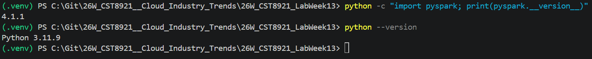
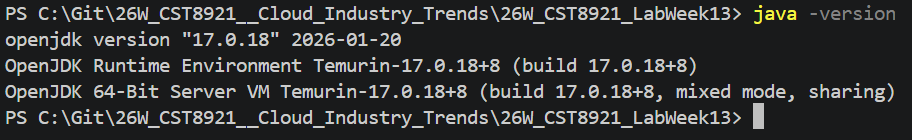
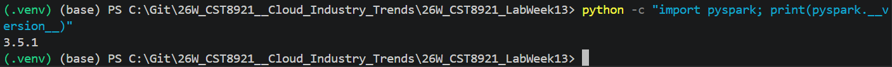

# Cloud Industry Trends - Lab Week 13

**St: Olga Durham** \
**St#: 040687883**

---

## 1. Install the Prerequisites

Make sure you have these installed on your machine:

```
pip install pyspark
```

You also need Java 8 or 11 installed, since Spark runs on the JVM. Check with java -version in your terminal. If missing, download it from adoptium.net.

---

## 2. VS Code Extensions to Install

Open the Extensions panel (Ctrl+Shift+X) and install:

- Python (Microsoft) — essential
- Jupyter (Microsoft) — if you want to run it as a notebook (.ipynb)
- Pylance — for autocomplete and type hints

---

## End-to-End Lab Instructions: ETL vs ELT with PySpark in VS Code

### Prerequisites (Do This Before Lab Day)

#### 1. Install Python Go to python.org and download Python 3.8 or higher. During installation on Windows, check the box that says "Add Python to PATH".

Verify in your terminal:

```
python --version
```

#### 2. Install Java PySpark requires Java 8 or 11. Go to adoptium.net, download the Temurin JDK 11 installer for your OS, and run it.

Verify:

```
java -version
```

#### 3. Install VS Code

Download from code.visualstudio.com and install it.

#### 4. Install the Python Extension in VS Code

Open VS Code → press Ctrl+Shift+X → search Python → install the one by Microsoft.

---

## Part 1 — Project Setup

### Step 1.1 — Create your project folder

Open your terminal (or VS Code's built-in terminal with Ctrl+`` ) and run:

```
mkdir data_engineering_lab
cd data_engineering_lab
```

### Step 1.2 — Create and activate a virtual environment

A virtual environment keeps your project's dependencies isolated from the rest of your system.

On Mac/Linux:

```
python -m venv venv
source venv/bin/activate
```

On Windows:

```
python -m venv venv
venv\Scripts\activate
```

You should now see (venv) at the start of your terminal prompt.

### Step 1.3 — Install PySpark

```
pip install pyspark
```

Verify it installed correctly:

```
python -c "import pyspark; print(pyspark.**version**)"
```

---

## Checkpoint complete. Environment is ready

- Python: 3.11.9
- Java: 17.0.18
- PySpark: 4.1.1





---

### Step 1.4 — Create the requirements file

```
pip freeze > requirements.txt
```

This records your dependencies so others can replicate your environment.

### Step 1.5 — Open the project in VS Code

```
code .
```

This opens the current folder in VS Code. If code . doesn't work on Mac, open VS Code manually, then go to File → Open Folder and select data_engineering_lab.

### Step 1.6 — Select your Python interpreter

Press Ctrl+Shift+P → type "Python: Select Interpreter" → choose the one that shows ./venv or venv. This tells VS Code to use your virtual environment.

---

## Part 2 — Create the Project Files

Your final folder structure will look like this:

```
data_engineering_lab/
├── venv/
├── requirements.txt
├── data/
│ └── (Spark output will appear here)
└── etl_elt_lab.py
```

### Step 2.1 — Create the data folder

In the VS Code Explorer panel (left sidebar), right-click → New Folder → name it data.

### Step 2.2 — Create the main script

Right-click in the Explorer panel → New File → name it etl_elt_lab.py.

### Step 2.3 — Paste in the full script

Copy the entire script below into etl_elt_lab.py:

<details>
    <summary>READ MORE

```
import os
from pyspark.sql import SparkSession
from pyspark.sql import functions as F
from pyspark.sql.types import (
StructType, StructField,
IntegerType, StringType, DoubleType
)

# ── Cross-platform output paths ──────────────────────────────

BASE_DIR = os.path.join(os.getcwd(), "data")
ETL_PATH = os.path.join(BASE_DIR, "etl_output", "orders_clean")
ELT_RAW = os.path.join(BASE_DIR, "elt_output", "orders_raw")

# ── Spark Session ────────────────────────────────────────────

spark = SparkSession.builder \
 .appName("ETL_vs_ELT_Lab") \
 .master("local[*]") \
 .getOrCreate()

spark.sparkContext.setLogLevel("ERROR")
print("Spark session started successfully.")

# ============================================================

# RAW DATASET — simulated e-commerce orders

# ============================================================

raw_data = [
(1, "Alice", "2024-01-15", "electronics", 299.99, "completed"),
(2, "bob", "2024-01-16", "CLOTHING", 45.00, "completed"),
(3, "Charlie", "2024-01-16", "Electronics", 199.50, "pending"),
(4, "alice", "2024-01-17", "clothing", 89.99, "cancelled"),
(5, "David", "2024-01-18", "FOOD", 12.50, "completed"),
(6, "Eve", "2024-01-18", "food", None, "completed"),
(7, "Frank", "2024-01-19", "electronics", 450.00, "pending"),
(8, "Grace", "2024-01-20", "Clothing", 75.00, "completed"),
(9, "Heidi", "2024-02-01", "food", 22.00, "completed"),
(10, "Ivan", "2024-02-02", "ELECTRONICS", 600.00, "completed"),
]

schema = StructType([
StructField("order_id", IntegerType(), True),
StructField("customer", StringType(), True),
StructField("order_date", StringType(), True),
StructField("category", StringType(), True),
StructField("amount", DoubleType(), True),
StructField("status", StringType(), True),
])

raw_df = spark.createDataFrame(raw_data, schema)

print("=" * 55)
print("RAW DATA (as extracted from source)")
print("=" * 55)
raw_df.show()

# ============================================================

# PART 1 — ETL PIPELINE

# ============================================================

print("=" * 55)
print("PART 1: ETL — Transform BEFORE Load")
print("=" * 55)

# ── Step 1: Extract ──────────────────────────────────────────

print("\n[ETL] Step 1 — Extract")
print(f"Row count : {raw_df.count()}")
print(f"Null amounts: {raw_df.filter(F.col('amount').isNull()).count()}")

# ── Step 2: Transform ────────────────────────────────────────

print("\n[ETL] Step 2 — Transform")

transformed_df = (
raw_df
.withColumn("customer", F.initcap(F.col("customer")))
.withColumn("category", F.lower(F.col("category")))
.withColumn("order_date", F.to_date(F.col("order_date"), "yyyy-MM-dd"))
.withColumn("amount", F.coalesce(F.col("amount"), F.lit(0.0)))
.withColumn("order_month", F.month(F.col("order_date")))
.filter(F.col("status") != "cancelled")
)

print("Transformed DataFrame (cancelled rows removed, fields cleaned):")
transformed_df.show()

# ── Step 3: Load ─────────────────────────────────────────────

print("\n[ETL] Step 3 — Load (writing clean data to Parquet)")

transformed_df.write \
 .mode("overwrite") \
 .parquet(ETL_PATH)

print(f"ETL load complete → {ETL_PATH}\n")

# ── Verify ───────────────────────────────────────────────────

etl_result = spark.read.parquet(ETL_PATH)
print("Verified ETL output (read back from Parquet):")
etl_result.orderBy("order_id").show()

# ============================================================

# PART 2 — ELT PIPELINE

# ============================================================

print("=" * 55)
print("PART 2: ELT — Load FIRST, Transform After")
print("=" * 55)

# ── Step 1: Extract & Load raw ───────────────────────────────

print("\n[ELT] Step 1 — Load raw data as-is")

raw_df.write \
 .mode("overwrite") \
 .parquet(ELT_RAW)

print(f"Raw load complete → {ELT_RAW}")

# ── Step 2: Register as SQL table ────────────────────────────

print("\n[ELT] Step 2 — Register raw data as SQL view")

raw_loaded = spark.read.parquet(ELT_RAW)
raw_loaded.createOrReplaceTempView("orders_raw")
print("View 'orders_raw' registered.")

# ── Step 3: Transform with SQL ───────────────────────────────

print("\n[ELT] Step 3 — Transform using Spark SQL")

transformed_sql = spark.sql("""
SELECT
order_id,
INITCAP(customer) AS customer,
TO_DATE(order_date, 'yyyy-MM-dd') AS order_date,
LOWER(category) AS category,
COALESCE(amount, 0.0) AS amount,
status,
MONTH(TO_DATE(order_date, 'yyyy-MM-dd')) AS order_month
FROM orders_raw
WHERE status != 'cancelled'
""")

print("ELT transformed result:")
transformed_sql.orderBy("order_id").show()

# ── Step 4: Second transformation — Summary mart ─────────────

print("\n[ELT] Step 4 — Build category summary mart from raw table")

category_summary = spark.sql("""
SELECT
LOWER(category) AS category,
COUNT(\*) AS total_orders,
ROUND(SUM(COALESCE(amount, 0.0)), 2) AS total_revenue,
ROUND(AVG(COALESCE(amount, 0.0)), 2) AS avg_order_value
FROM orders_raw
WHERE status = 'completed'
GROUP BY LOWER(category)
ORDER BY total_revenue DESC
""")

print("Category Summary (completed orders only):")
category_summary.show()

# ============================================================

# PART 3 — COMPARISON

# ============================================================

print("=" * 55)
print("PART 3: ETL vs ELT Output Comparison")
print("=" * 55)

etl_sorted = etl_result.orderBy("order_id")
elt_sorted = transformed_sql.orderBy("order_id")

etl_count = etl_sorted.count()
elt_count = elt_sorted.count()

print(f"ETL row count : {etl_count}")
print(f"ELT row count : {elt_count}")

if etl_count == elt_count:
    print("Row counts match.")
else:
    print(" Row counts differ — investigate!")

print("\nETL Schema:")
etl_sorted.printSchema()
print("ELT Schema:")
elt_sorted.printSchema()

print("\nSide-by-side sample (first 5 rows each):")
print("── ETL output ──")
etl_sorted.show(5)
print("── ELT output ──")
elt_sorted.show(5)

print("Lab complete. Answer the discussion questions in your writeup.")

spark.stop()

```

    </summary>

</details>

---

## Part 3 — Run the Script

### Step 3.1 — Open the integrated terminal

Press Ctrl+`` in VS Code. Make sure you see (venv) in the prompt. If not, re-activate with venv\Scripts\activate (Windows) or source venv/bin/activate (Mac/Linux).

### Step 3.2 — Run the script

```
python etl_elt_lab.py
```

### Step 3.3 — What to expect

The script will print output in clearly labelled sections:

- Raw data display
- ETL: transformed DataFrame, confirmation of Parquet write
- ELT: SQL transformation output, category summary mart
- Comparison: row counts and schemas side by side

The first run takes 20–30 seconds while Spark initialises. Subsequent runs are faster.

### Step 3.4 — Check the output files

In the VS Code Explorer, expand the data/ folder. You should see:

```
data/
├── etl_output/
│ └── orders_clean/ ← clean Parquet files (ETL)
└── elt_output/
└── orders_raw/ ← raw Parquet files (ELT)
```

---

## Part 4 — Discussion Questions

Write your answers in a separate document and submit with your lab:

1. Both pipelines produced the same final output. What is the key architectural difference between them?
2. The ELT pipeline preserved the raw data in orders_raw. Why is this valuable when business requirements change?
3. The ELT pipeline built a category_summary mart as a second SQL step without touching the ETL path. How does this demonstrate ELT's flexibility?
4. If this dataset were 100 GB on a distributed Spark cluster, which approach would likely perform better and why?
5. Identify one real-world scenario where you would still prefer ETL over ELT.

---
